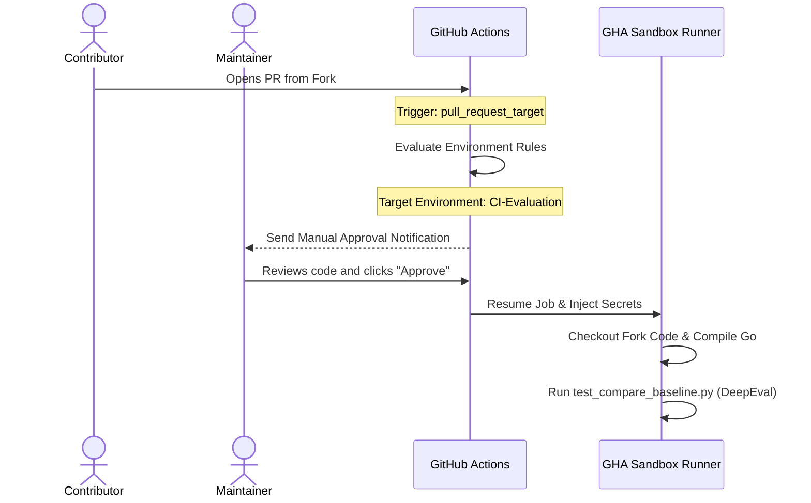

# GKE-MCP Secure CI/CD Baseline Evaluation Plan

This document outlines the architectural plan to enable secure baseline performance evaluations on **all Pull Requests (PRs)**, including those created by external contributors from repository forks.

---

## 1. Problem Statement & Constraints

*   **Baseline Evaluations Require Secrets**: The evaluation test suite (`test_compare_baseline.py`) runs manifest generation, pulls model outputs, and computes LLM-as-a-judge metrics (G-Eval, Answer Relevancy) using Gemini API. This **strictly requires API credentials** (`GCP_SA_KEY` and `GEMINI_API_KEY`).
*   **Security Constraint (Forks)**: Under standard GitHub Actions (GHA), secrets are **never injected into workflows triggered by pull requests from forks** to prevent malicious PRs from reading and stealing credentials.
*   **Direct Trigger Vulnerability**: Using `pull_request_target` directly without guards is a well-known vulnerability, as it executes arbitrary code from the fork (e.g., tests, compiler) inside an environment that holds secrets.

---

## 2. Proposed Secure Solution: Gated Dynamic Environments

We utilize **Privilege Separation** using **GitHub Environments** combined with a **`pull_request_target`** trigger.



---

## 3. Workflow Logic & Configuration

The updated `.github/workflows/eval-on-pr.yml` file uses a dynamic environment expression:

```yaml
jobs:
  evaluate:
    runs-on: ubuntu-latest
    environment: ${{ (github.event.pull_request.head.repo.full_name == github.repository) && 'CI-No-Approval' || 'CI-Evaluation' }}
```

### Execution Paths

1.  **Maintainer PRs (Branches inside `GoogleCloudPlatform/gke-mcp`)**:
    *   The expression selects the **`CI-No-Approval`** environment.
    *   Since this environment has no protection rules, the workflow **executes automatically and immediately**.
2.  **External Fork PRs (Community Contributors)**:
    *   The expression selects the gated **`CI-Evaluation`** environment.
    *   The run is **paused** under manual review.
    *   A maintainer must review the PR changes to ensure there are no malicious attempts to exfiltrate credentials, then click **"Approve"** to allow the job to proceed.

This design is secure because the `pull_request_target` trigger loads the workflow configuration exclusively from the base repository's `main` branch. Forks cannot alter the gate.

---

## 4. Setup Instructions for Repository Admins

To activate this system in GitHub, a repository administrator must complete a one-time configuration:

1.  **Create Environments**:
    *   Navigate to **Settings** > **Environments** > **New environment**.
    *   Create an environment named **`CI-Evaluation`** (for fork PRs).
    *   Create a second environment named **`CI-No-Approval`** (for maintainers).
2.  **Configure Protection Rules on `CI-Evaluation`**:
    *   Check **Required reviewers**.
    *   Add repo maintainers who are authorized to approve runs.
3.  **Populate Secrets**:
    *   Under both `CI-Evaluation` and `CI-No-Approval` environments, add the environment secrets:
        *   `GCP_SA_KEY`
        *   `GEMINI_API_KEY`
